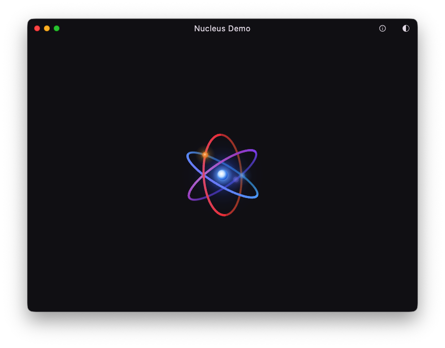
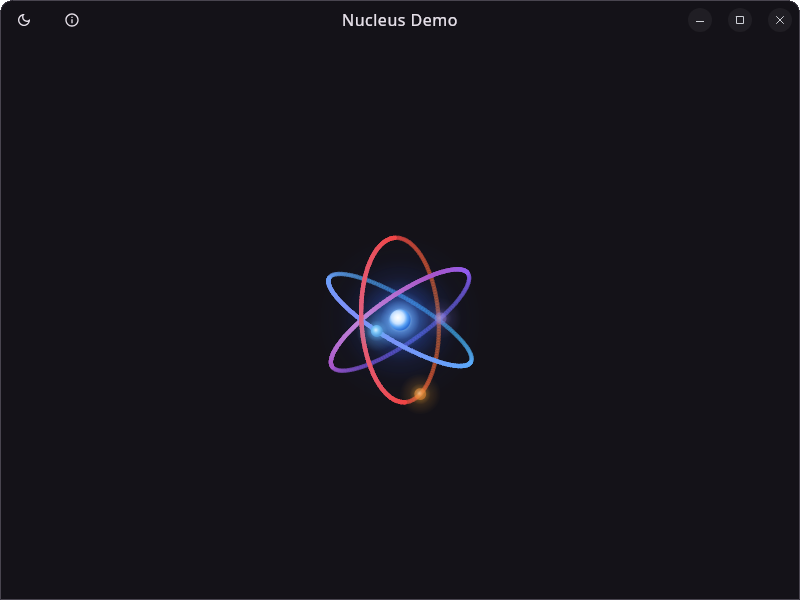
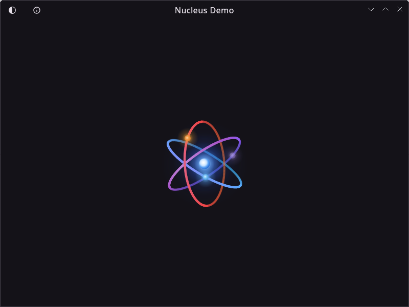

# Decorated Window

Compose for Desktop does not allow drawing custom content in the title bar while keeping native window controls and native behavior (drag, resize, double-click maximize). You must choose between a native title bar you cannot customize, or a fully undecorated window where you reimplement everything from scratch.

The `decorated-window` module bridges this gap. It is a fork of [Jewel](https://github.com/JetBrains/intellij-community/tree/master/platform/jewel)'s decorated window, **without any dependency on Jewel itself**. Key differences from Jewel:

- **No JNA** — all native calls use JNI only, removing the JNA dependency entirely
- **Design-system agnostic** — no Material dependency; easily map any theme (Material 3, Jewel, your own) to its styling tokens
- **`DecoratedDialog`** — custom title bar for dialog windows, which Jewel does not provide
- **Reworked Linux rendering** — the entire Linux experience has been rebuilt from the ground up to look as native as possible, even though everything is drawn with Compose: platform-accurate GNOME Adwaita and KDE Breeze window controls, proper window shape clipping, border styling, and full behavior emulation (drag, double-click maximize, focus-aware button states)

On macOS and Windows, the module uses [JetBrains Runtime (JBR)](https://github.com/JetBrains/JetBrainsRuntime)'s `CustomTitleBar` API to place arbitrary Compose content (icons, text, buttons, gradients) inside the title bar while preserving native window controls and behavior.

!!! note
    If you use Material 3, see the companion module [`decorated-window-material`](decorated-window-material.md) which wires `MaterialTheme.colorScheme` automatically.

## Installation

```kotlin
dependencies {
    implementation("io.github.kdroidfilter:nucleus.decorated-window:<version>")
}
```

## Quick Start

```kotlin
fun main() = application {
    NucleusDecoratedWindowTheme(isDark = true) {
        DecoratedWindow(
            onCloseRequest = ::exitApplication,
            title = "My App",
        ) {
            TitleBar { state ->
                Text(
                    title,
                    modifier = Modifier.align(Alignment.CenterHorizontally),
                    color = LocalContentColor.current,
                )
            }
            // Your app content
            MyContent()
        }
    }
}
```

## Screenshots

=== "macOS"

    

=== "Windows"

    

=== "Linux (GNOME)"

    

=== "Linux (KDE)"

    

## Platform Behavior

|  | macOS | Windows | Linux |
|---|-------|---------|-------|
| Decoration | JBR `CustomTitleBar` | JBR `CustomTitleBar` | Fully undecorated |
| Window controls | Native traffic lights | Native min/max/close | Compose `WindowControlArea` (SVG icons) |
| Drag | JBR hit-test | JBR `forceHitTest` | `JBR.getWindowMove().startMovingTogetherWithMouse()` |
| Double-click maximize | Native | Native | Manual detection |
| Border | None | None | `insideBorder` (hidden when maximized) |
| Window shape | Native | Native | Rounded top corners (GNOME 12dp, KDE 5dp) |

On **macOS** and **Windows**, the module uses JBR's `CustomTitleBar` API to integrate with the native window chrome. The OS-native window buttons (traffic lights on macOS, min/max/close on Windows) are preserved.

On **Linux**, the window is fully undecorated. The module renders its own close/minimize/maximize buttons using SVG icons adapted to the desktop environment (GNOME Adwaita or KDE Breeze). The window shape is also clipped to rounded corners to match the native look.

## Components

### `NucleusDecoratedWindowTheme`

Provides styling for all decorated window components via `CompositionLocal`. Must wrap `DecoratedWindow` / `DecoratedDialog`.

```kotlin
NucleusDecoratedWindowTheme(
    isDark: Boolean = true,
    windowStyle: DecoratedWindowStyle = DecoratedWindowDefaults.dark/lightWindowStyle(),
    titleBarStyle: TitleBarStyle = DecoratedWindowDefaults.dark/lightTitleBarStyle(),
) {
    // DecoratedWindow / DecoratedDialog go here
}
```

The `isDark` flag selects the built-in dark or light presets. Pass your own `windowStyle` / `titleBarStyle` to override any or all values.

### `DecoratedWindow`

Drop-in replacement for Compose `Window()`. Manages window state (active, fullscreen, minimized, maximized) and platform-specific decorations.

```kotlin
DecoratedWindow(
    onCloseRequest = ::exitApplication,
    state = rememberWindowState(),
    title = "My App",
    icon = null,
    resizable = true,
) {
    TitleBar { state -> /* title bar content */ }
    // window content
}
```

The `content` lambda receives a `DecoratedWindowScope` which exposes:

- `window: ComposeWindow` — the underlying AWT window
- `state: DecoratedWindowState` — current window state (`.isActive`, `.isFullscreen`, `.isMinimized`, `.isMaximized`)

### `DecoratedDialog`

Same concept for dialog windows. Uses `DialogWindow` internally. Dialogs only show a close button on Linux (no minimize/maximize).

```kotlin
DecoratedDialog(
    onCloseRequest = { showDialog = false },
    title = "Settings",
    resizable = false,
) {
    DialogTitleBar { state ->
        Text(title, modifier = Modifier.align(Alignment.CenterHorizontally))
    }
    // dialog content
}
```

### `TitleBar` / `DialogTitleBar`

Platform-dispatched title bar composable. Provides a `TitleBarScope` with:

- `title: String` — the window title passed to `DecoratedWindow`
- `icon: Painter?` — the window icon
- `Modifier.align(alignment: Alignment.Horizontal)` — positions content within the title bar

```kotlin
TitleBar { state ->
    // Left-aligned icon
    Icon(
        painter = myIcon,
        contentDescription = null,
        modifier = Modifier.align(Alignment.Start),
    )

    // Centered title
    Text(
        title,
        modifier = Modifier.align(Alignment.CenterHorizontally),
        color = LocalContentColor.current,
    )

    // Right-aligned action
    IconButton(
        onClick = { /* ... */ },
        modifier = Modifier.align(Alignment.End),
    ) {
        Icon(Icons.Default.Settings, contentDescription = "Settings")
    }
}
```

Centered content is automatically shifted to avoid overlapping with start/end content.

## Styling

### Mapping Your Own Theme

The key idea: `NucleusDecoratedWindowTheme` accepts two style objects. You build them from whatever color system you use:

```kotlin
// Example: map a custom theme to decorated window styles
val myWindowStyle = DecoratedWindowStyle(
    colors = DecoratedWindowColors(
        border = MyTheme.colors.border,
        borderInactive = MyTheme.colors.border.copy(alpha = 0.5f),
    ),
    metrics = DecoratedWindowMetrics(borderWidth = 1.dp),
)

val myTitleBarStyle = TitleBarStyle(
    colors = TitleBarColors(
        background = MyTheme.colors.surface,
        inactiveBackground = MyTheme.colors.surfaceDim,
        content = MyTheme.colors.onSurface,
        border = MyTheme.colors.outline,
        titlePaneButtonHoveredBackground = MyTheme.colors.onSurface.copy(alpha = 0.08f),
        titlePaneButtonPressedBackground = MyTheme.colors.onSurface.copy(alpha = 0.12f),
        titlePaneCloseButtonHoveredBackground = MyTheme.colors.error,
        titlePaneCloseButtonPressedBackground = MyTheme.colors.error.copy(alpha = 0.7f),
    ),
    metrics = TitleBarMetrics(height = 40.dp),
    icons = TitleBarIcons(), // null = use platform defaults
)

NucleusDecoratedWindowTheme(
    isDark = MyTheme.isDark,
    windowStyle = myWindowStyle,
    titleBarStyle = myTitleBarStyle,
) {
    DecoratedWindow(...) { ... }
}
```

### `DecoratedWindowStyle`

Controls the window border (visible only on Linux):

| Property | Description |
|----------|-------------|
| `colors.border` | Border color when window is active |
| `colors.borderInactive` | Border color when window is inactive |
| `metrics.borderWidth` | Border width (default 1.dp) |

### `TitleBarStyle`

Controls the title bar appearance:

| Property | Description |
|----------|-------------|
| `colors.background` | Title bar background when active |
| `colors.inactiveBackground` | Title bar background when inactive |
| `colors.content` | Default content color (exposed via `LocalContentColor`) |
| `colors.border` | Bottom border of the title bar |
| `colors.fullscreenControlButtonsBackground` | Background for macOS fullscreen traffic lights |
| `colors.titlePaneButtonHoveredBackground` | Hover background for min/max buttons |
| `colors.titlePaneButtonPressedBackground` | Press background for min/max buttons |
| `colors.titlePaneCloseButtonHoveredBackground` | Hover background for close button |
| `colors.titlePaneCloseButtonPressedBackground` | Press background for close button |
| `metrics.height` | Title bar height (default 40.dp) |
| `metrics.gradientStartX` / `gradientEndX` | Gradient range (see below) |
| `icons` | Custom `Painter` for close/minimize/maximize/restore buttons (null = platform default) |

## Gradient

The `TitleBar` composable accepts a `gradientStartColor` parameter. When set, the title bar background becomes a horizontal gradient that transitions from the `background` color through `gradientStartColor` and back to `background`:

```
[background] → [gradientStartColor] → [background]
```

The gradient range is controlled by `TitleBarMetrics.gradientStartX` and `gradientEndX`.

```kotlin
TitleBar(
    gradientStartColor = Color(0xFF6200EE),
) { state ->
    Text(title, modifier = Modifier.align(Alignment.CenterHorizontally))
}
```

When `gradientStartColor` is `Color.Unspecified` (the default), the background is a solid color.

## macOS Fullscreen Controls

On macOS, use the `newFullscreenControls()` modifier on `TitleBar` to enable the new-style fullscreen controls (traffic lights stay visible in fullscreen mode with a colored background):

```kotlin
TitleBar(modifier = Modifier.newFullscreenControls()) { state ->
    // ...
}
```

This sets the `apple.awt.newFullScreenControls` system property and uses `fullscreenControlButtonsBackground` from your `TitleBarStyle`.

## JBR Requirement

`DecoratedWindow` and `DecoratedDialog` **require** JetBrains Runtime (JBR). The module throws an `IllegalStateException` at startup if JBR is not detected.

!!! tip
    When running via `./gradlew run`, Gradle uses the JDK configured in your toolchain. Make sure it is a JBR distribution. When packaging with Nucleus (`packageDmg`, `packageMsi`, etc.), you can bundle JBR by configuring the `javaHome` or `jdkVersionProbe` in your build.

## Linux Desktop Environment Detection

On Linux, the module detects the current desktop environment and loads the appropriate icon set:

- **GNOME** — Adwaita-style icons, rounded top corners (12dp radius)
- **KDE** — Breeze-style icons, rounded top corners (5dp radius)
- **Other** — Falls back to GNOME style

Detection uses `XDG_CURRENT_DESKTOP` and `DESKTOP_SESSION` environment variables.
